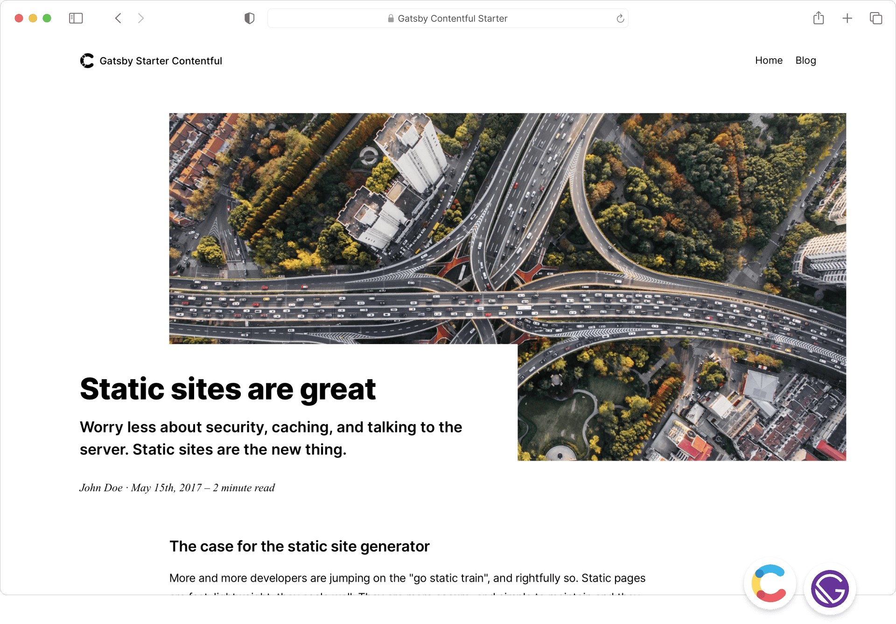

# Contentful Gatsby Starter Blog

Create a [Gatsby](http://gatsbyjs.com/) blog powered by [Contentful](https://www.contentful.com).



Static sites are scalable, secure and have very little required maintenance. They come with a drawback though. Not
everybody feels good editing files, building a project and uploading it somewhere. This is where Contentful comes into
play.

With Contentful and Gatsby you can connect your favorite static site generator with an API that provides an easy to use
interface for people writing content and automate the publishing using services like [Travis CI](https://travis-ci.org/)
or [Netlify](https://www.netlify.com/).

## Features

- Simple content model and structure. Easy to adjust to your needs.
- Use
  the [synchronization feature](https://www.contentful.com/developers/docs/references/content-delivery-api/#/reference/synchronization)
  of our [Delivery API](https://www.contentful.com/developers/docs/references/content-delivery-api/).
- Responsive/adaptive images via [gatsby-plugin-image](https://www.gatsbyjs.org/packages/gatsby-plugin-image/) and
  our [Images API](https://www.contentful.com/developers/docs/references/content-delivery-api/#/reference/synchronization/initial-synchronization-of-entries-of-a-specific-content-type).

## Getting started

See
our [official Contentful getting started guide](https://www.contentful.com/developers/docs/tutorials/general/get-started/).

### Get the source code and install dependencies.

```
$ git clone https://github.com/contentful/starter-gatsby-blog.git
$ npm install
```

Or use Gatsby Cloud

Use Deploy Now to get started in [Gatsby Cloud](https://gatsbyjs.com/products/cloud):

[](https://www.gatsbyjs.com/dashboard/deploynow?url=https://github.com/contentful/starter-gatsby-blog)

If you use Deploy Now, Gatsby Cloud will run the `gatsby-provision` script on your behalf, if you choose, after you
Quick Connected to your empty Contentful Space. That script will add the necessary content models and content to support
this site.

Or use the [Gatsby CLI](https://www.npmjs.com/package/gatsby-cli).

```
$ gatsby new contentful-starter-blog https://github.com/contentful/starter-gatsby-blog/
```

### Set up of the needed content model and create a configuration file

This project comes with a Contentful setup command `npm run setup`.

This command will ask you for a space ID, and access tokens for the Contentful Management and Delivery API and then
import the needed content model into the space you define and write a config file (`./.contentful.json`).

`npm run setup` automates that for you but if you want to do it yourself rename `.contentful.json.sample`
to `.contentful.json` and add your configuration in this file.

## Crucial Commands

### `npm run dev`

Run the project locally with live reload in development mode.

### `npm run build`

Run a production build into `./public`. The result is ready to be put on any static hosting you prefer.

### `npm run serve`

Spin up a production-ready server with your blog. Don't forget to build your page beforehand.

## Deployment

See
the [official Contentful getting started guide](https://www.contentful.com/developers/docs/tutorials/general/get-started/).

## Contribution

Feel free to open pull requests to fix bugs. If you want to add features, please have a look at
the [original version](https://github.com/contentful-userland/gatsby-contentful-starter). It is always open to
contributions and pull requests.

You can learn more about how Contentful userland is organized by
visiting [our about repository](https://github.com/contentful-userland/about).

My Notes:
I'm trying to figure out the best way to render rich text. I'd
like to create a dedicated component just for that purpose.
In looking into this I thought it curious that currently
I have these packages:
"@contentful/rich-text-plain-text-renderer": "^15.12.1",
"@contentful/rich-text-react-renderer": "^15.16.2",
"gatsby-source-contentful": "^8.5.0",

Contentful's official starter only has this @contentful package:
"@contentful/rich-text-plain-text-renderer": "^15.12.1",
"gatsby-source-contentful": "^8.5.0",

so they don't have rich-text-react-renderer

Then Gatsby's official contentful starter has these:
"@contentful/rich-text-html-renderer": "^15.11.1",
"gatsby-source-contentful": "^8.0.0",

rich-text-html-renderer isn't even one I have or have heard of.
Is this a case where contentful has forgotten about gatsby but
gatsby is still on the ball?

I just installed @contentful/rich-text-html-renderer and will try it
and the html one, we will see.

@contentful/rich-text-plain-text-renderer has least features.
doesn't let you use a component in the options for rendering.

These two both look similar:
@contentful/rich-text-react-renderer
@contentful/rich-text-html-renderer

I'm not sure where I found the rich-text-react-renderer and why
gatsby isn't using it

On contentful's docs they use rich-text-react-renderer soo..
https://www.contentful.com/developers/docs/concepts/rich-text/